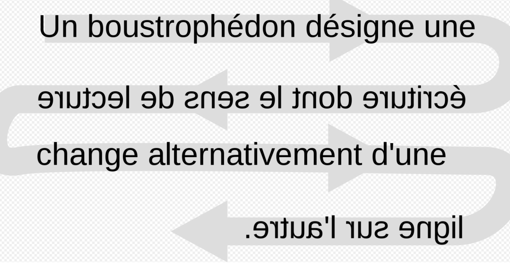
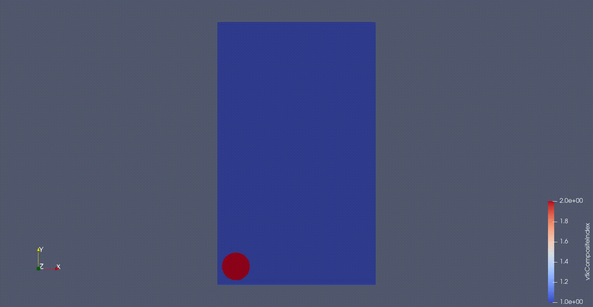

<!-- ***"Rien n'est plus fécond tous les mathématiciens le savent que ces obscures analogies, ces troubles reflets d'une théorie à une autre, ces furtives caresses, ces broulleries inexplicables; rien aussi ne donne plus de plaisir au chercheur.*** 

***Un jour vient où l'illusion se dissipe, le pressentiment se change en certitude, les théories jumelles révèlent leurs sources communes avant de disparaître; comme l'enseigne la Gita on atteint à la connaissance et à l'indifférence en même temps.*** 

***La métaphysique est devenue mathématique, prête à former la matière d'un traité dont la beauté froide ne saurait plus émouvoir."*** -->

Motion planning is an essential pillar of modern robotics, enabling robots to move efficiently and autonomously in their environment. In the field of mobile robotics, motion planning is of particular importance, as it plays a crucial role in applications such as cleaning robots, where complete coverage of an area is essential for optimum performance.

The `Boustrophedon Cell Decomposition (BCD)` is a method for coverage path planning for cleaning robots. 
This cell decomposition method divides the robot's reachable area into non-overlapping cellular regions. 
The robot's trajectory is then determined by the sequence of cells to be visited.

In this project, we implement the BCD algorithm for a cleaning robot to cover a given area.

***Results:***

To visualize the robot's trajectory, we read the `csv` file of positions (which contains `x`, `y` cells and `time`), create cells covering the entire domain and make the robot follow the path created.

  
Path

  

To simulate the robot's trajectory in a fluid, we use the fluid toolbox of the Feel++ finite element library and the `csv` file containing the velocities.

<!-- <video width="600" controls>
  <source src="images/pathvideo.mp4" type="video/mp4">
  Your browser does not support the video tag.
</video> -->

  
Trajectory

  

<!--  -->